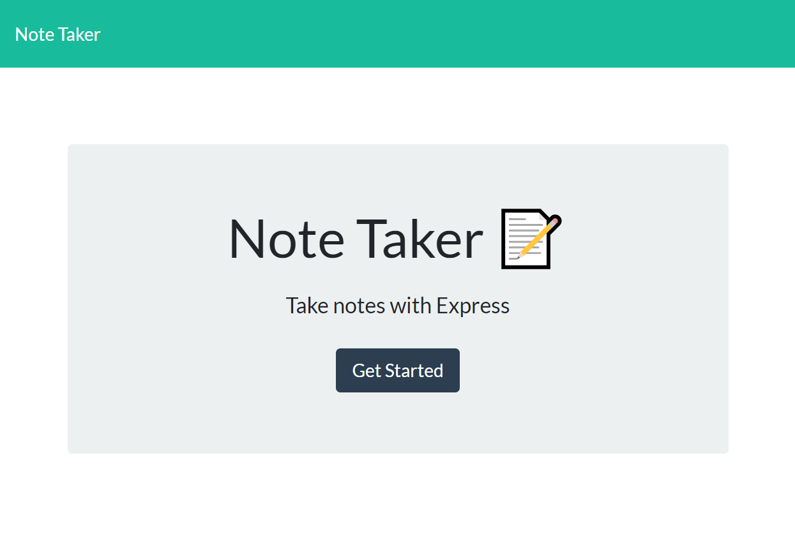
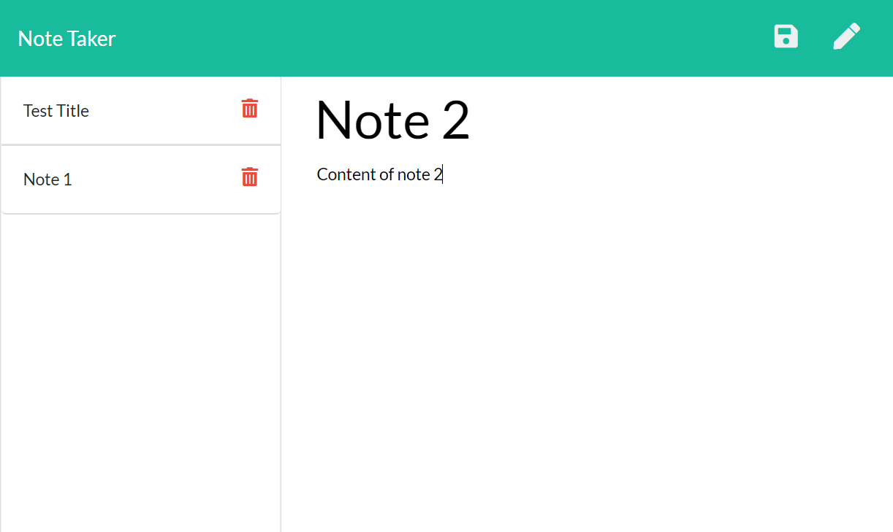

# Homework 11 - Note Taker

The aim of this assignment is to utilize Express and node to create an application to write, save, and delete notes. Express is the backend, and a JSON file is used to retrieve and save data. 

## User Story

```
AS A user, I want to be able to write and save notes.

I WANT to be able to delete notes I've written before.

SO THAT I can organize my thoughts and keep track of tasks I need to complete.

```

## Composition of Application

After executing the node command and starting the server, the user is able to access the home page on localhost port 3000 and navigate to the notes page to write and save notes. Saved notes are written to the JSON file with a unique id, and are listed on the left side of the page. Clicking on saved notes allows the notes to be viewed again in the main text boxes, and clicking on the trash icon next to a specific note allows them to be deleted (and they will be removed from the JSON file). The JSON file is read and displayed every time the application re-starts.

The application is also hosted on Heroku.


## Process

I first worked on the server.js file to set up Express and the server port, then the htmlRoutes.js file to set up GET requests for the HTML routes (the pages of application), then the apiRoutes.js file to write our all the API calls (GET, POST, DELETE). The index.js file contains the javascript and functions for generating the dynamic HTML prompted by click events. 

console.log was useful for catching errors and ensuring data produced was accurate and in the right format. 

The dependencies for the application are listed in the package.JSON file and a gitignore file is used to to skip and prevent upload of the node_modules folder to GitHub.

## Deployment

The completed application is available for download in Github: 
https://github.com/jenjch/noteTaker

The deployed application is available on heroku:
https://notetaker-5123534.herokuapp.com/

Images of the application layout:





## Acceptance Criteria

I believe I have met all requirements for the application. Feedback on best practices and improvements would be appreciated.  